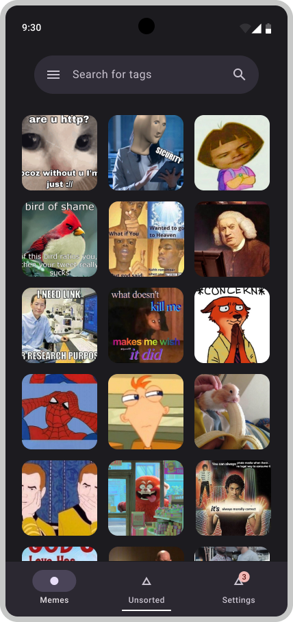
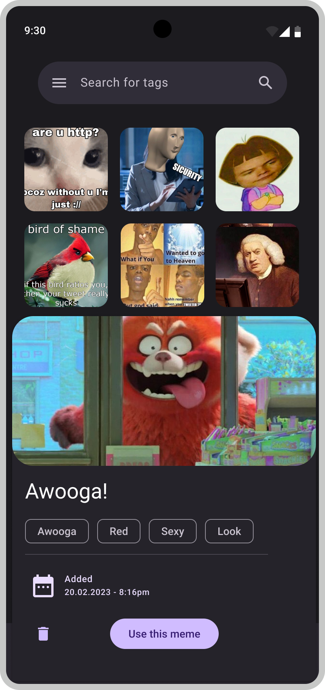

<h1 align="center">MEEM</h1>

It's a tool to organize your own meme library by assigning tags to each meme.

 

  
  &nbsp;&nbsp;&nbsp;&nbsp;&nbsp;&nbsp;&nbsp;
  

  <i>These are only Figma designs at the point of writing. They are subject to change.</i>

# Current state
This project isn't finished. It isn't even usable yet.

I recommend you to not even try to build it yourself. Give me some more time to do it right.

## Architecture
MEEM can used in two modes:
- **Local mode:** Storage and management happens on your Android device.
- **External mode:** Storage and management is on an external server hosted by you. Useful for large meme folders that need to be streamed.

## License
This project is licensed under the **Apache License 2.0** as stated in the project root.

## Future plans
- Central server hosted by me which collects (only if you agree) meme fingerprints and there user-generated tags, so you don't have to do the heavy lifting if others already did it.
- Angular frontend to browse your precious on your computer.
